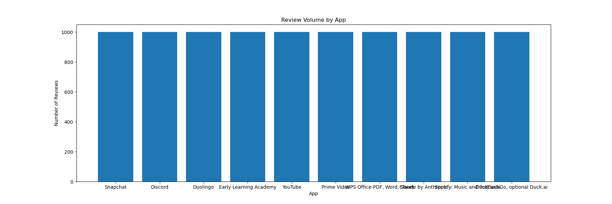
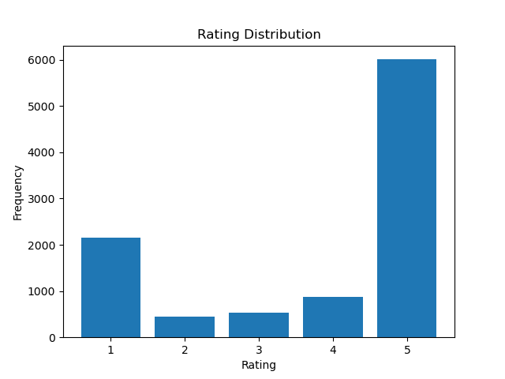
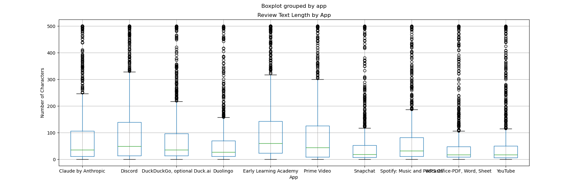
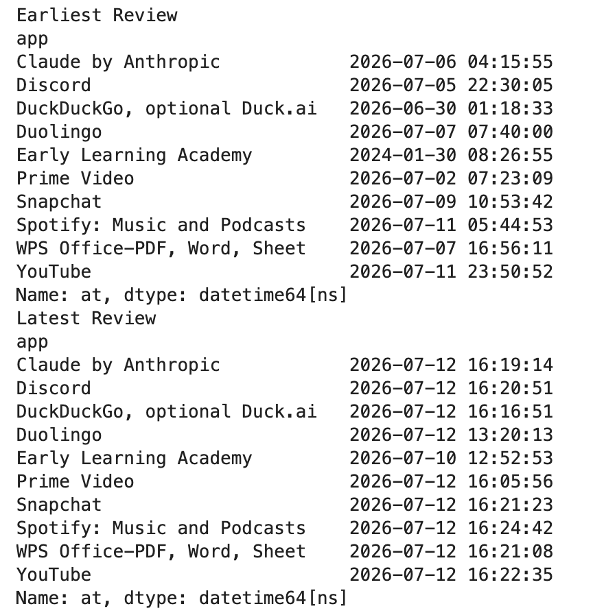
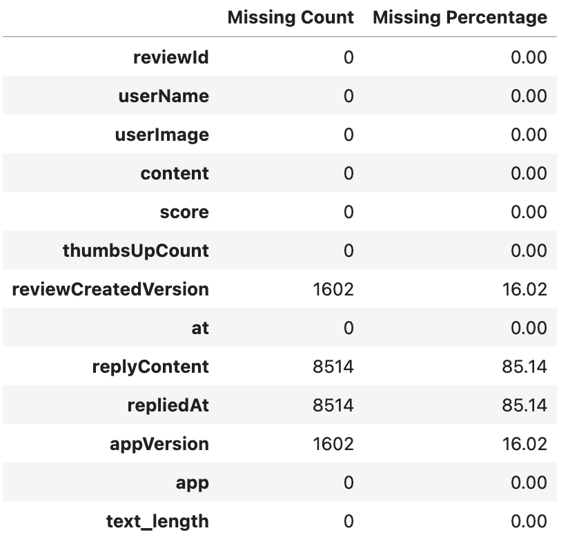
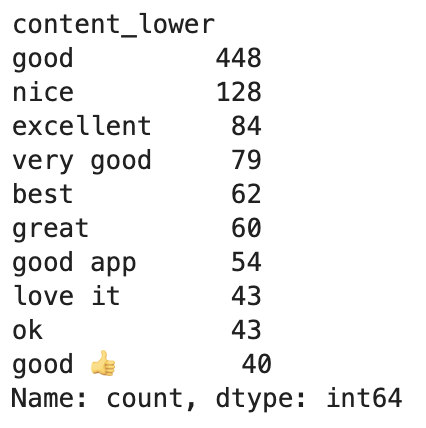

# Google Play Review Collection

This project collects Google Play reviews from multiple popular applications using the `google-play-scraper` package and performs exploratory data analysis to evaluate the quality of the collected data for downstream database constructions.

## Related Projects Used
https://github.com/facundoolano/google-play-scraper

### Installation
```python
npm install google-play-scraper
```

## Review Collection Procedure
Review data was collected from Google Play using the google-play-scraper Python package. A total of ten popular applications from different categories, including social media, education, productivity, entertainment, AI assistants, and utilities, were selected to provide a diverse sample for evaluating data quality. Each application was identified by its official Google Play package ID to ensure consistent and reproducible data collection

For each application, the scraper retrieved the 1,000 most recent reviews using the Sort.NEWEST option, resulting in a dataset of approximately 10,000 reviews. The returned review objects were converted into Pandas DataFrames, and an additional app column was added to identify the source application of each review. Finally, the individual DataFrames were merged into a single dataset using pd.concat(), which served as the input for the subsequent EDA.

By default, the langauge is set as English, and the country is set to US.
```python
from google_play_scraper import Sort, reviews
import pandas as pd

# app list
apps_dict = {
    "Snapchat": "com.snapchat.android", 
    "Discord": "com.discord",
    "Duolingo": "com.duolingo",
    "Early Learning Academy": "mobi.abcmouse.academy_goo",
    "YouTube": "com.google.android.youtube",
    "Prime Video": "com.amazon.avod.thirdpartyclient", 
    "WPS Office-PDF, Word, Sheet": "cn.wps.moffice_eng",
    "Claude by Anthropic": "com.anthropic.claude",
    "Spotify: Music and Podcasts": "com.spotify.music",
    "DuckDuckGo, optional Duck.ai": "com.duckduckgo.mobile.android"
}

all_reviews=[]

# review collect
for app_name, app_id in apps_dict.items():
    result, continuation_token = reviews(
        app_id,
        sort=Sort.NEWEST, 
        count=1000,
    )

    df = pd.DataFrame(result)
    print(app_name, len(df))
    df["app"] = app_name
    all_reviews.append(df)
    

review_tab = pd.concat(all_reviews, ignore_index=True)
```

## EDA
### Review Volume By App
The first step of the exploratory data analysis is to examine the number of reviews collected for each application. 
``` python
import matplotlib.pyplot as plot

# review volume by app
figure, axis = plot.subplots(figsize = (18, 6))
count_data = review_tab["app"].value_counts()

# get the x and y data
apps = count_data.index
frequencies = count_data.values
axis.bar(apps, frequencies)

axis.set_title("Review Volume by App")
axis.set_xlabel("App")
axis.set_ylabel("Number of Reviews")

plot.show()
```
#### Output


Since the collection process was configured to retrieve up to 1,000 of the most recent reviews per app, this visualization is used to verify that the data collection was completed successfully and that each application contributed a comparable number of reviews. Consistent review counts across applications help reduce sampling bias in subsequent analyses.

### Rating Distribution
The chart below shows the distribution of review ratings across all collected Google Play reviews. Most reviews received a 5-star rating, while 1-star reviews were the second most common. Ratings of 2, 3, and 4 stars appeared much less frequently. This indicates that the dataset is highly imbalanced, with positive reviews dominating the collection while a smaller but still meaningful number of negative reviews is available for downstream sentiment analysis.
```python
figure, axis = plot.subplots()
count_data = review_tab["score"].value_counts().sort_index()
ratings = count_data.index
frequencies = count_data.values
axis.bar(ratings, frequencies)
axis.set_title("Rating Distribution")
axis.set_xlabel("Rating")
axis.set_ylabel("Frequency")
plot.show()
```
#### Output


The rating distribution is highly skewed toward positive feedback. Five-star reviews account for the largest proportion of the dataset, indicating that most users report positive experiences with the selected applications. One-star reviews form the second largest group, suggesting that while dissatisfaction is less common, negative feedback is still substantial enough to support further analysis. Ratings of 2, 3, and 4 stars occur much less frequently, resulting in an imbalanced distribution that should be considered in downstream sentiment analysis and model development.

### Text Length
The boxplot below compares the distribution of review text lengths across the ten selected applications. Review length is measured by the number of characters in each review. The boxplots summarize the median, interquartile range (IQR), overall spread, and potential outliers for each application, providing an overview of how detailed user reviews tend to be across different apps.
```python
review_tab["text_length"] = review_tab["content"].str.len()

figure, axis = plot.subplots(figsize = (18, 6))
review_tab.boxplot(column="text_length", by="app", ax=axis)
axis.set_title("Review Text Length by App")
axis.set_xlabel("App")
axis.set_ylabel("Number of Characters")
plot.show()

figure.savefig("TextLength.png")
```
#### Output


Review text lengths vary across applications, although most reviews are relatively short. Early Learning Academy and Discord exhibit the highest median review lengths and the widest interquartile ranges, suggesting that users tend to provide more detailed feedback for these applications. In contrast, Snapchat, YouTube, and WPS Office generally contain shorter reviews. All applications show a considerable number of long-text outliers, with some reviews approaching 500 characters, indicating that while most users leave concise comments, a subset provides substantially more detailed feedback.

### Timestamp Coverage
The table below summarizes the earliest and latest review timestamps for each application in the dataset. By comparing the time range covered by the collected reviews, we can evaluate how recent the data is and understand the review activity level of each application.
```python
print("Earliest Review")
display(review_tab.groupby("app")["at"].min())

print("Latest Review")
display(review_tab.groupby("app")["at"].max())
```
#### Output


The timestamp coverage varies considerably across applications. Most high-traffic applications, such as YouTube, Spotify, Snapchat, and Discord, have review windows spanning only a few days, indicating a high volume of recent user activity. In contrast, Early Learning Academy covers reviews dating back to January 2024, suggesting a much lower review frequency. Since the collection process retrieves the most recent 1,000 reviews for each application, the length of the time window directly reflects the review activity of each app.

### Missing Fields
The table below summarizes the number and percentage of missing values for each field in the collected dataset. Evaluating missing data helps determine whether the dataset is complete enough for downstream processing and identifies fields that may require special handling during data cleaning.
```python
missing = pd.DataFrame({
    "Missing Count": review_tab.isnull().sum(),
    "Missing Percentage": (review_tab.isnull().mean()*100).round(2)
})
missing
```
#### Output


Most core review fields, including `reviewId`, `userName`, `content`, `score`, `thumbsUpCount`, `at`, and `app`, contain no missing values, indicating that the dataset is complete for review-level analysis. Missing values are mainly concentrated in metadata fields. Specifically, `replyContent` and `repliedAt` are missing for 85.14% of reviews because developer replies are only available when an application owner has responded to a review. In addition, `reviewCreatedVersion` and `appVersion` have approximately 16% missing values, suggesting that version information is unavailable for a subset of reviews. These missing values are expected and are unlikely to affect most text analysis or sentiment modeling tasks.

### Duplicate Review IDs
This check identifies whether multiple records share the same review ID. Since `reviewId` is expected to uniquely identify each review, duplicate IDs may indicate duplicated records introduced during the collection or ingestion process.
```python
review_tab["reviewId"].duplicated().sum()
```

The output here is 0. No duplicate review IDs were detected in the collected dataset. This confirms that each review is uniquely identified and suggests that the review collection process did not introduce duplicate records. As a result, `reviewId` can be reliably used as the primary key for downstream database design and data ingestion.

### Repeated Review Text
This analysis examines whether multiple reviews contain identical review text. Unlike duplicate review IDs, repeated review text does not necessarily indicate duplicate records, as different users may submit the same or very similar comments. Identifying repeated review text helps evaluate the diversity and information content of the collected dataset.
```python
# Number of repeated review texts
duplicate_count = review_tab["content"].duplicated().sum()

# Repeated review texts
duplicate_text = review_tab[review_tab["content"].duplicated()][["app", "content"]]

# Most common repeated review texts
duplicate_textCount = review_tab["content"].value_counts()
duplicate_textCount = duplicate_textCount[duplicate_textCount > 1]
duplicate_textCount.head(10)
```
#### Output


Repeated review text is common in the dataset, particularly for very short comments. Frequently repeated reviews include generic expressions such as "good", "nice", "very good", and "excellent". These comments are likely produced independently by different users rather than resulting from duplicated records, as no duplicate review IDs were detected. The results suggest that while the dataset is free from duplicated entries, it contains a substantial number of low-information reviews that may contribute limited value for downstream text analysis. Such reviews could be filtered or treated separately during preprocessing if higher-quality textual information is desired.

### Low-signal Reviews


### Language Issues


