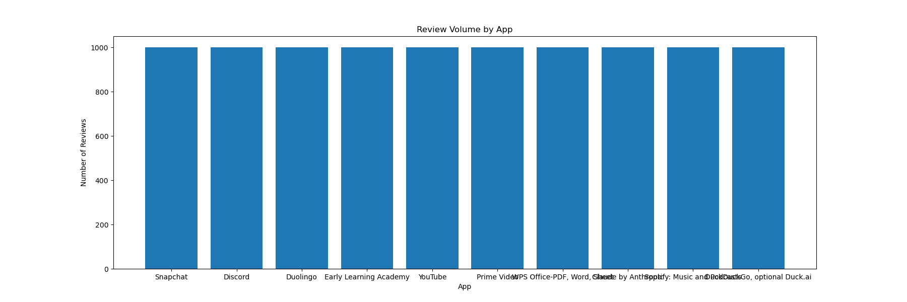
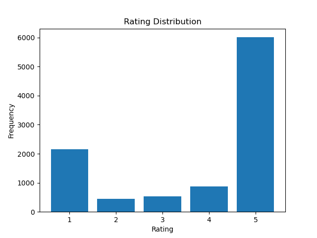
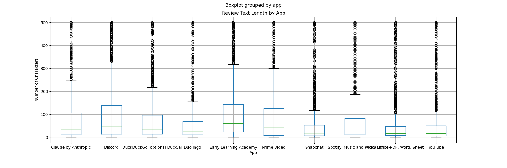
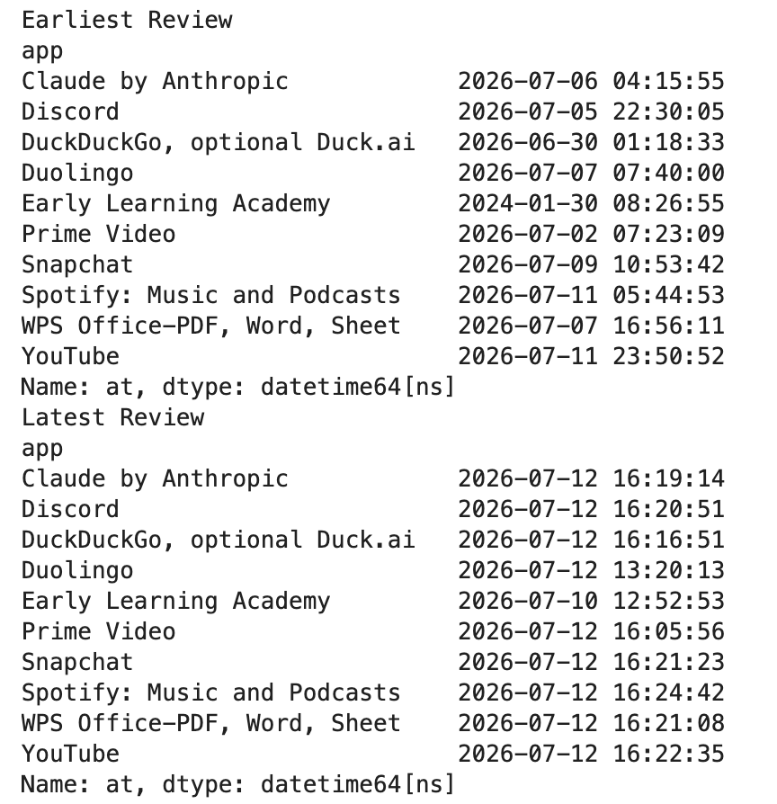
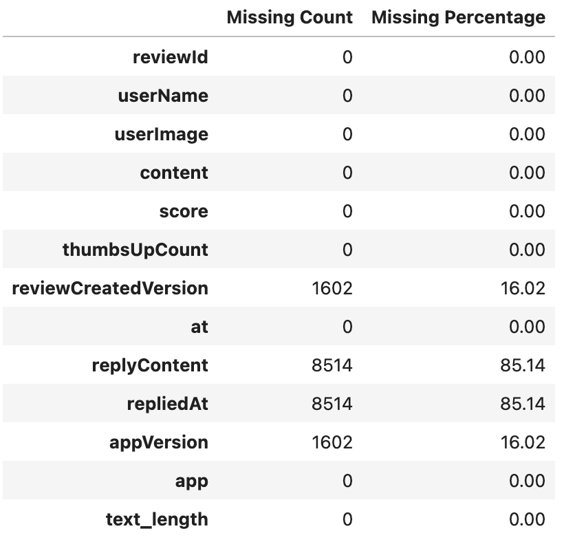
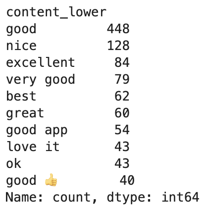
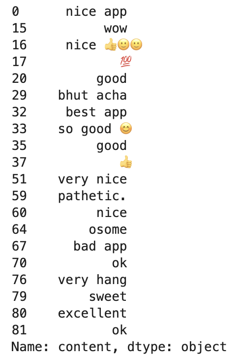
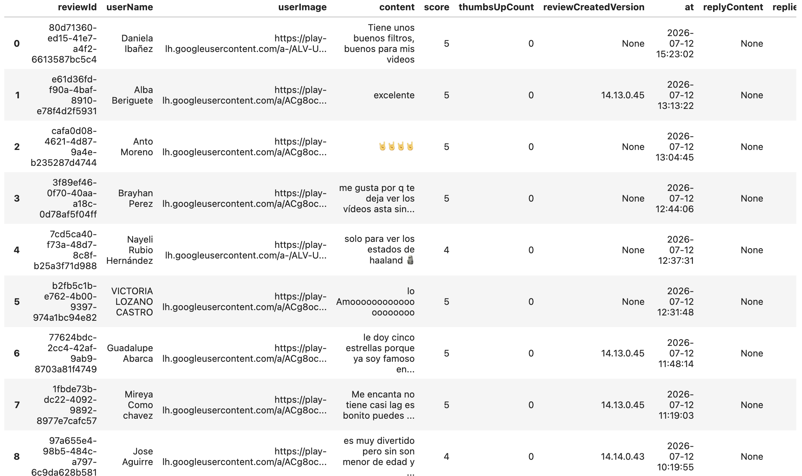
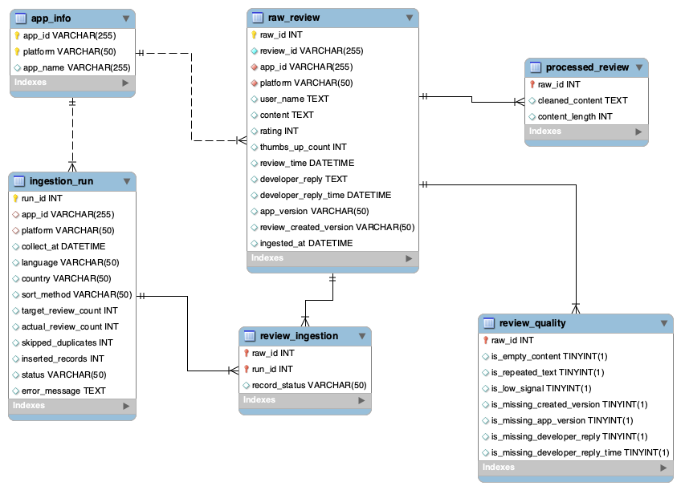

# Google Play Review Collection

## Project Introduction
This project evaluates Google Play as a potential source of user-generated review data for downstream AI and data pipeline development. The goal is to assess the feasibility of collecting, structuring, and maintaining app review data for future database storage and ingestion workflows. A review collection pipeline was developed using the `google-play-scraper` package to retrieve reviews from selected applications. The collected data was then examined through exploratory data analysis to understand dataset completeness, consistency, and usability. The findings provide insights into the strengths and limitations of Google Play as a potential long-term review data source.

## Data Source
Google Play was selected as the primary data source because it provides a large volume of publicly available user reviews across a wide range of applications. Reviews were collected using the google-play-scraper package by querying each application's package ID. 

## Related Packages Used
This project mainly used the `google-play-scraper` package for Google Play Store review collection.
Additional Python packages are used for data processing and visualization, including `pandas` and `matplotlib`.

For more information about `google-play-scraper` package, please visit [here](https://pypi.org/project/google-play-scraper/).

### Installation
```bash
pip install google-play-scraper pandas matplotlib
```

## Review Collection Procedure
A total of ten popular applications from different categories, including social media, education, productivity, entertainment, AI assistants, and utilities, were selected to provide a diverse sample for evaluating data quality. Each application was identified by its official Google Play package ID to ensure consistent and reproducible data collection.

The selected applications include: 

| Application | Package ID |
|--------------|----------|
| Snapchat | com.snapchat.android |
| Discord | com.discord |
| Duolingo | com.duolingo |
| Early Learning Academy | mobi.abcmouse.academy_goo |
| YouTube | com.google.android.youtube |
| Prime Video | com.amazon.avod.thirdpartyclient |
| WPS Office | cn.wps.moffice_eng |
| Claude | com.anthropic.claude |
| Spotify | com.spotify.music |
| DuckDuckGo | com.duckduckgo.mobile.android |

For each application, the scraper retrieved the 1,000 most recent reviews using the Sort.NEWEST option, resulting in a dataset of approximately 10,000 reviews. The returned review objects were converted into Pandas DataFrames, and an additional app column was added to identify the source app of each review. Finally, the individual DataFrames were merged into a single dataset using pd.concat(), which served as the input for the subsequent EDA.

Parameters in function `reviews()`:
| Parameters | Function |
|--------------|----------|
| appId | Unique application id for Google Play. |
| lang  | Optional, defaults to 'en', the two letter language code in which to fetch the reviews. |
| country | Optional, defaults to 'us', the two letter country code in which to fetch the reviews. |
| sort | Optional, defaults to sort.NEWEST. The way the reviews are going to be sorted. Accepted values are: sort.NEWEST, sort.RATING and sort.HELPFULNESS. |
| count | Optional, defaults to 100. Quantity of reviews to be captured. |
| filter_score_with | Defaults to None(means all score). |

For the following demonstrations, reviews were collected using lang="en" and country="us".
```python
from google_play_scraper import Sort, reviews
import pandas as pd

# app list
apps_dict = {
    "Snapchat": "com.snapchat.android", 
    "Discord": "com.discord",
    "Duolingo": "com.duolingo",
    "Early Learning Academy": "mobi.abcmouse.academy_goo",
    "YouTube": "com.google.android.youtube",
    "Prime Video": "com.amazon.avod.thirdpartyclient", 
    "WPS Office-PDF, Word, Sheet": "cn.wps.moffice_eng",
    "Claude by Anthropic": "com.anthropic.claude",
    "Spotify: Music and Podcasts": "com.spotify.music",
    "DuckDuckGo, optional Duck.ai": "com.duckduckgo.mobile.android"
}

all_reviews=[]

# review collect
for app_name, app_id in apps_dict.items():
    result, continuation_token = reviews(
        app_id,
        sort=Sort.NEWEST, 
        count=1000,
    )

    df = pd.DataFrame(result)
    print(app_name, len(df))
    df["app"] = app_name
    all_reviews.append(df)
    

review_tab = pd.concat(all_reviews, ignore_index=True)
```

## EDA
### Review Volume By App
The first step of the exploratory data analysis is to examine the number of reviews collected for each application. 
``` python
import matplotlib.pyplot as plot

# review volume by app
figure, axis = plot.subplots(figsize = (18, 6))
count_data = review_tab["app"].value_counts()

# get the x and y data
apps = count_data.index
frequencies = count_data.values
axis.bar(apps, frequencies)

axis.set_title("Review Volume by App")
axis.set_xlabel("App")
axis.set_ylabel("Number of Reviews")

plot.show()
```
#### Output


Since the collection process was configured to retrieve up to 1,000 of the most recent reviews per app, this visualization is used to verify that the data collection was completed successfully and that each application contributed a comparable number of reviews. Consistent review counts across applications help reduce sampling bias in subsequent analyses.

### Rating Distribution
Below, we focus more on the distribution of review ratings across all collected Google Play reviews. 
```python
figure, axis = plot.subplots()
count_data = review_tab["score"].value_counts().sort_index()
ratings = count_data.index
frequencies = count_data.values
axis.bar(ratings, frequencies)
axis.set_title("Rating Distribution")
axis.set_xlabel("Rating")
axis.set_ylabel("Frequency")
plot.show()
```
#### Output


The rating distribution is highly skewed toward positive feedback. Five-star reviews account for the largest proportion of the dataset, indicating that most users report positive experiences with the selected applications. One-star reviews has the second largest population, suggesting that while dissatisfaction is less common, negative feedback is still substantial enough to support further analysis. Ratings of 2, 3, and 4 stars occur much less frequently, resulting in an imbalanced distribution that should be considered in downstream sentiment analysis and model development.

### Text Length
Review length is measured by the number of characters in each review. The boxplots summarize the median, IQR, overall spread, and potential outliers for each application, providing an overview of how detailed user reviews tend to be across different apps.
```python
review_tab["text_length"] = review_tab["content"].str.len()

figure, axis = plot.subplots(figsize = (18, 6))
review_tab.boxplot(column="text_length", by="app", ax=axis)
axis.set_title("Review Text Length by App")
axis.set_xlabel("App")
axis.set_ylabel("Number of Characters")
plot.show()

figure.savefig("TextLength.png")
```
#### Output


The boxplot below compares the distribution of review text lengths across the ten selected apps. Review text lengths vary across applications, although most reviews are relatively short. Early Learning Academy and Discord exhibit the highest median review lengths and the widest IQR ranges, suggesting that users tend to provide more detailed feedback for these applications. In contrast, Snapchat, YouTube, and WPS Office generally contain shorter reviews. All applications show a considerable number of long-text outliers, with some reviews approaching 500 characters, indicating that while most users leave concise comments, a subset provides substantially more detailed feedback.

### Timestamp Coverage
The table below summarizes the earliest and latest review timestamps for each application in the dataset. By comparing the time range covered by the collected reviews, we can evaluate how recent the data is and understand the review activity level of each application.
```python
print("Earliest Review")
display(review_tab.groupby("app")["at"].min())

print("Latest Review")
display(review_tab.groupby("app")["at"].max())
```
#### Output


The timestamp coverage varies considerably across applications. Most high-traffic applications, such as YouTube, and Spotify, have review windows spanning only a few days, indicating a high volume of recent user activity. In contrast, Early Learning Academy covers reviews dating back to January 2024, suggesting a much lower review frequency. Since the collection process retrieves the most recent 1,000 reviews for each application, the length of the time window directly reflects the review activity of each app.

### Missing Fields
The table below summarizes the number and percentage of missing values for each field in the collected dataset. Evaluating missing data helps determine whether the dataset is complete enough for downstream processing and identifies fields that may require special handling during data cleaning.
```python
missing = pd.DataFrame({
    "Missing Count": review_tab.isnull().sum(),
    "Missing Percentage": (review_tab.isnull().mean()*100).round(2)
})
missing
```
#### Output


Most core review fields, including `reviewId`, `userName`, `content`, `score`, `thumbsUpCount`, `at`, and `app`, contain no missing values, indicating that the dataset is complete for basic analysis. Missing values are mainly concentrated in a few metadata fields, like `replyContent` and `repliedAt` are missing for 85.14% of reviews because developer replies are only available when an application owner has responded to a review. In addition, `reviewCreatedVersion` and `appVersion` have approximately 16% missing values, suggesting that version information is unavailable for a subset of reviews. These missing values are expected and are unlikely to affect most text analysis or sentiment modeling tasks.

### Duplicate Review IDs
This check identifies whether multiple records share the same review ID. Since `reviewId` is expected to uniquely identify each review, duplicate IDs may indicate duplicated records introduced during the collection or ingestion process.
```python
review_tab["reviewId"].duplicated().sum()
```

The output here is 0. No duplicate review IDs were detected in the collected dataset. This confirms that each review is uniquely identified and suggests that the review collection process did not introduce duplicate records. As a result, `reviewId` can be reliably used as the primary key for downstream database design and data ingestion.

### Repeated Review Text
This analysis examines whether multiple reviews contain identical review text. Unlike duplicate review IDs, repeated review text does not necessarily indicate duplicate records, as different users may submit the same or very similar comments. Identifying repeated review text helps evaluate the diversity and information content of the collected dataset.
```python
# convert review text to lowercase
review_tab["content_lower"] = review_tab["content"].str.lower().str.strip()

# Number of repeated review texts
duplicate_count = review_tab["content_lower"].duplicated().sum()

# Repeated review texts
duplicate_text = review_tab[review_tab["content_lower"].duplicated()][["app", "content"]]

# Most common repeated review texts
duplicate_textCount = review_tab["content_lower"].value_counts()
duplicate_textCount = duplicate_textCount[duplicate_textCount > 1]
duplicate_textCount.head(10)
```
#### Output


Repeated review text is common in the dataset, particularly for very short comments. Frequently repeated reviews included "good", "nice", and "excellent". These comments are likely produced independently by different users rather than resulting from duplicated records, as no duplicate review IDs were detected. The results suggest that while the dataset is free from duplicated entries, it contains a substantial number of low-information reviews that may contribute limited value for downstream text analysis. Such reviews could be filtered or treated separately during preprocessing if higher-quality textual information is desired.

### Low-signal Reviews
Low-signal reviews contain very little textual information and therefore contribute limited value for downstream text analysis. In this project, reviews with fewer than 10 characters were classified as low-signal reviews. This analysis estimates the proportion of such reviews and provides examples of their content.
```python
low_signal = review_tab[review_tab["text_length"] < 10]
len(low_signal)
len(low_signal) / len(review_tab) * 100
low_signal["content"].head(20)
```
#### Output


A noticeable portion of the collected reviews contains fewer than 10 characters. Most of these reviews consist of short expressions such as "nice app", "wow", or emojis. Although these reviews often reflect positive or negative sentiment, they provide little contextual information about user experience, product features, or specific issues. Depending on the objectives of downstream tasks, these reviews may be removed or processed separately to improve the quality of text-based analyses.

### Language Issues
To verify that the `google-play-scraper` language and country parameters work as expected, an additional dataset was collected using `lang="es"` and `country="es"`. For each application, 100 of the newest reviews were retrieved and stored in a separate DataFrame. This experiment evaluates whether the scraper can reliably collect reviews from different languages.
```python
all_reviews_other = []

for app_name, app_id in apps_dict.items():
    result, continuation_token = reviews(
        app_id,
        lang="es",
        country="es",
        sort=Sort.NEWEST,
        count=100
    )

    df = pd.DataFrame(result)

    df["app"] = app_name
    df["language_setting"] = "Spanish"

    all_reviews_other.append(df)

    print(app_name, len(df))

review_other_tab = pd.concat(
    all_reviews_other,
    ignore_index=True
)

review_other_tab.head(20)
```
#### Output
Part of the output:


The collected reviews are written in Spanish, with user names, review text, and expressions consistently matching the selected language and region. Each application successfully returned 100 reviews, indicating that the language and country filters were applied correctly. This demonstrates that the scraper can support multilingual review collection, making it suitable for future cross-language analysis or international data ingestion pipelines.

### Summary EDA
- Approximately 10,000 reviews were collected from 10 popular Google Play applications using a consistent collection strategy.
- The dataset contains complete core fields (review ID, review text, rating, timestamp), making it suitable for downstream analysis.
- No duplicate review IDs were found, indicating that review IDs can serve as reliable unique identifiers.
- Most missing values occur in developer reply and app version-related fields, as expected, because not every review receives a developer response or reports an app version.
- Review text lengths and rating distributions vary across applications, while repeated review texts are primarily short, low-information comments (e.g., "good", "nice") rather than duplicated records.
- Because reviews were collected using Sort.NEWEST, high-traffic apps cover shorter time windows, whereas lower-traffic apps include reviews spanning much longer periods.

### Current Limitations
- The dataset only contains the most recent reviews and should not be treated as complete historical data. To retrieve all review data, the function `reviews()` could be replaced with `reviews_all()`.
- Data was collected only from Google Play using English (US) settings, so reviews from other regions, languages, or platforms are not included. Need additional settings to retrieve reviews from other regions or languages.
- Some metadata (e.g., app version and developer replies) is unavailable for a portion of reviews because it is not always provided by Google Play.
- Low-signal reviews (such as very short comments or emoji-only responses) remain in the raw dataset and require additional filtering for certain analyses. Need to be seperated from repeated contents.

### Next Steps
- Separate raw reviews, processed reviews, quality assessment results, and ingestion metadata into dedicated tables.
- Build a repeatable ingestion pipeline that supports scheduled review collection and timely updates.
- Apply additional preprocessing, including text normalization, and low-signal and repeated content filtering.
- Use the processed dataset for later downstream tasks.

## Schema Design
### Overview
This schema is designed to support the collection, storage, and processing of Google Play review data. The design separates raw review data from processed data and quality evaluation results while also tracking each ingestion run for reproducibility and future recurring collection. Although the current implementation focuses on Google Play, the schema includes a platform field to support future expansion to additional review sources.


### Table Description
### `app_info`
Stores information about each application being collected from a review platform.

`app_id`: Unique application identifier (e.g., Google Play package ID)

`platform`: Review source platform (e.g., Google Play)

`app_name`: Human-readable application name

Primary Key (Composite): (`app_id`, `platform`)

Foreign Key: None

### `raw_review`
Stores immutable, original review data directly fetched from the source platform. 

`raw_id`: Internal database identifier

`review_id`: Review identifier provided by the source platform

`app_id`: Unique application identifier

`platform`: Review source platform

`user_name`: Reviewer name

`content`: Original review text

`rating`: Review rating

`thumbs_up_count`: Helpful vote count

`review_time`: Review creation time

`developer_reply`: Developer response

`developer_reply_time`: Time of developer response

`app_version`: Application version

`review_created_version`: Application version when the review was created (usually align with `app_version`)

`ingested_at`: Timestamp when the review was first collected

Primary Key: `raw_id`

Foreign Key: (`platform`, `app_id`) --> app_info(`platform`, `app_id`)

### `processed_review`
Stores cleaned and standardized review text generated from the raw review table. The original review remains unchanged to preserve data provenance.

`raw_id`: Associated raw review identifier provided by the source platform.

`cleaned_content`: Normalized review text

`content_length`: Length of cleaned review text

Primary Key: `raw_id`

Foreign Key: `raw_id` --> raw_review(`raw_id`)

### `ingestion_run`
Stores metadata for each review collection run. Each record represents one execution of the collection pipeline for a specific application under a specific collection configuration.

`run_id`: Unique ingestion run identifier

`app_id`: Application identifier of the app collected during this run

`platform`: Source platform

`collect_at`: Collection timestamp

`language`: Language parameter used during collection

`country`: Country parameter used during collection

`sort_method`: Review sorting method (e.g., newest)

`target_review_count`: Number of reviews requested

`actual_review_count`: Number of reviews returned

`skipped_duplicates`: Number of duplicate reviews skipped

`inserted_records`: Number of new reviews inserted into the database

`status`: Overall execution status

`error_message`: Error information if the run failed

Primary Key: `run_id`

Foreign Key: (`app_id`, `platform`) --> app_info(`app_id`, `platform`)

### `review_ingestion`
Records the relationship between reviews and ingestion runs. This table enables recurring collections by tracking which reviews were observed during each collection run.

`raw_id`: Internal database identifier

`run_id`: Ingestion run identifier

`record_status`: Status of the review during this run (Inserted, Duplicate)

Primary Key (Composite): (`raw_id`, `run_id`)

Foreign Key: `raw_id` --> raw_review(`raw_id`), `run_id` --> ingestion_run(`run_id`)

### `review_quality`
Stores quality assessment results derived from the raw review data and processed review data.

`raw_id`: Internal database identifier

`is_empty_content`: Indicates whether the processed review content is empty

`is_repeated_text`: Indicates duplicated raw review text

`is_low_signal`: Indicates low-information processed reviews

`is_missing_created_version`: Missing review creation version from `raw_review` table

`is_missing_app_version`: Missing application version from `raw_review` table

`is_missing_developer_reply`: Missing developer reply from `raw_review` table

`is_missing_developer_reply_time`: Missing developer reply timestamp from `raw_review` table

Primary Key: `raw_id`

Foreign Key: `raw_id` --> processed_review(`raw_id`)

### Deduplication Logic
Although no duplicate review IDs were observed in the current Google Play dataset, using the source-provided review_id alone is not considered sufficiently robust for long-term database design. The database uses an internal surrogate key (raw_id) as the primary key. To prevent duplicate reviews, a unique constraint is defined on (platform, app_id, review_id). 

This composite key ensures that:
- review IDs remain unique across different applications;
- future support for multiple review platforms can be added without changing the schema;
- recurring ingestion runs can reliably identify previously collected reviews.

During each ingestion run, incoming reviews are compared against the existing composite key:
- If the combination already exists, the review is marked as duplicate.
- Otherwise, a new raw review record will be inserted.

### Quality Flag Logic
Quality checks are performed using both raw and processed review attributes. Raw review fields are used to validate source data completeness and ingestion quality, while processed review fields are used to evaluate text quality after cleaning. The generated quality flags are stored in the review_quality table and linked back to the original review through raw_id.

| Flag | Logic |
|--------------|----------|
| is_empty_content | TRUE if the review content is empty or null after processing. |
| is_repeated_text | TRUE if the raw review text is identical to another review collected for the same application. |
| is_low_signal | TRUE if the processed review contains little meaningful information, such as very short text or generic expressions (e.g., "Good", "Nice", "OK"). |
| is_missing_created_version | TRUE if the review_created_version field from `raw_review` table is missing. |
| is_missing_app_version | TRUE if the app_version field from `raw_review` table is missing. |
| is_missing_developer_reply | TRUE if no developer reply from `raw_review` table is available. |
| is_missing_developer_reply_time | TRUE if the developer reply timestamp from `raw_review` table is missing. |

Separating quality flags from both the raw and processed review tables allows the quality assessment logic to evolve independently while preserving the original data. These flags can be used for filtering low-quality reviews, monitoring dataset completeness, and supporting downstream tasks such as sentiment analysis.

### How Raw Reviews Connect To Processed Reviews
During each ingestion run, reviews are first collected from the platform and stored in the `raw_review` table without modification. These records preserve the original review text and metadata exactly as returned by the source platform.

The preprocessing stage then transforms each raw review into a processed review by performing basic text normalization, including:
- removing leading and trailing whitespace, and emojis;
- converting text into a standardized format (e.g., lowercase);
- generating the cleaned review text (cleaned_content);
- calculating the review text length (content_length).

The processed results are stored in the `processed_review` table and linked to the corresponding raw review through the `raw_id` field.

After preprocessing, the cleaned reviews are evaluated using a set of predefined quality rules. The resulting quality flags are stored in the `review_quality` table, enabling downstream filtering and quality analysis without modifying either the raw or processed review data.

## Integration Test
### Overview
The integration test validates the data pipeline by running a small-scale ingestion workflow and verifying that collected reviews can be correctly stored, processed, and linked across database tables.

The test focuses on:
- review collection from Google Play
- ingestion run tracking
- raw review insertion and deduplication
- raw-to-processed review transformation
- review quality flag generation

### Test Setup
A small-scale dataset was used to validate the end-to-end pipeline workflow. The test collected Google Play reviews from 10 selected applications. For each application, the pipeline retrieved up to 50 of the newest reviews.

The test's specific settings are: 
- Language: English (`en`)
- Country: United States (`us`)
- Sort method: Newest reviews (`NEWEST`)

The integration test was executed twice using the same configuration to verify the ingestion run tracking across multiple executions and duplicate review detection.

### Related Package Used
In addition to the packages mentioned above, package `mysql-connector-python` is used to connect mySQL and python. 

For more information about `mysql-connector-python` package, please visit [here](https://www.w3schools.com/python/python_mysql_getstarted.asp).

#### Installation
```bash
!pip install mysql-connector-python
```

### SQL Database Construction
The database was constructed in MySQL to store, process, and maintain Google Play review data. It is based on the designed relational schema. SQL scripts were used to create tables, define primary and foreign key relationships, and enforce uniqueness constraints for review deduplication. The database separates raw review storage, ingestion tracking, text processing, and quality monitoring into different tables. This structure preserves original data while supporting downstream processing and quality validation.

### Connecting MySQL And Python
Python was connected with MySQL to enable automated data ingestion, transformation, and validation within the review data pipeline. The connection was established using the `mysql-connector-python` package, allowing Python scripts to execute SQL queries and interact with database tables directly.
```python
import mysql.connector
connection = mysql.connector.connect(
    host="localhost",
    # The connection parameters (username, password, and database name) should be updated according to the local MySQL server environment before running the code
    user=your_username,
    password=your_password,
    database="review_collection"
)

# To check whether the connection is successful
print("Connected successfully!")
```

To verify that Python is connected to the correct MySQL database, the available tables can be retrieved using the following query:
```python
cursor = connection.cursor()
cursor.execute("SHOW TABLES")

for table in cursor:
    print(table)
```
If the connection is successful, all the table names in the database should be printed out.

### Data Ingestion Pipeline Implementation
#### app_info table
The `app_info` table stores metadata for each application included in the review collection process. Before inserting review data, application information is loaded into the database to provide a reference for downstream ingestion records.

The table stores:
- Application ID (package ID)
- Platform
- Application name

Each application is uniquely identified by the combination of platform and application ID to prevent duplicate application records.

```python
# app list
apps_dict = {
    "Snapchat": "com.snapchat.android", 
    "Discord": "com.discord",
    "Duolingo": "com.duolingo",
    "Early Learning Academy": "mobi.abcmouse.academy_goo",
    "YouTube": "com.google.android.youtube",
    "Prime Video": "com.amazon.avod.thirdpartyclient", 
    "WPS Office-PDF, Word, Sheet": "cn.wps.moffice_eng",
    "Claude by Anthropic": "com.anthropic.claude",
    "Spotify: Music and Podcasts": "com.spotify.music",
    "DuckDuckGo, optional Duck.ai": "com.duckduckgo.mobile.android"
}

# app_info table
sql_appinfo = "INSERT IGNORE INTO app_info (app_id, platform, app_name) VALUES (%s, %s, %s)"

for app_name, app_id in apps_dict.items():
    values_appinfo = (
        app_id,
        "Google Play",
        app_name
    )
    cursor.execute(sql_appinfo, values_appinfo)

connection.commit()

# To check whether the information is successfully stored
print("app_info inserted!")
```

After insertion, the stored application metadata can be verified using: 
```python
cursor.execute("SELECT * FROM app_info")

for row in cursor.fetchall():
    print(row)
```
#### Review Collection and Ingestion
After application metadata is stored in the `app_info` table, the pipeline collects review data from Google Play and loads the data into the database.

The ingestion process performs the following steps:
1. Creates an ingestion record in the `ingestion_run` table to track each collection execution.
2. Collects the newest reviews from Google Play using the `google-play-scraper` package.
3. Inserts original review data into the `raw_review` table while preserving source information.
4. Records the relationship between reviews and ingestion runs in the `review_ingestion` table.
5. Updates ingestion statistics, including inserted records and skipped duplicate reviews.

```python
from google_play_scraper import Sort, reviews
import pandas as pd
from datetime import datetime

# Settings
language = "en"
country = "us"
sort_method = "NEWEST"
target_count = 50

all_reviews=[]

# review collection
for app_name, app_id in apps_dict.items():
    result, continuation_token = reviews(
        app_id,
        sort=Sort.NEWEST,
        lang=language,
        country=country,
        count=target_count,
    )

    actual_count = len(result)
    print(app_name, actual_count)
```

Then, we will create ingestion_run table.

The `ingestion_run` table records metadata for each execution of the ingestion pipeline.

A new ingestion run is created before loading reviews because the final ingestion results, such as inserted records and duplicate records, are only available after the loading process is completed.

Initial values are assigned before ingestion:
- `inserted_records = 0`
- `skipped_duplicates = 0`
- `error_message = NULL`

These fields are updated after the review insertion process finishes with the actual ingestion results.

```python
sql = "INSERT INTO ingestion_run(app_id,platform,collect_at,language,country,sort_method,target_review_count,actual_review_count,skipped_duplicates,inserted_records,status,error_message) VALUES (%s,%s,%s,%s,%s,%s,%s,%s,%s,%s,%s,%s)"
    values = (app_id, "Google Play", datetime.now(), language, country, sort_method, target_count, actual_count, 0, 0, "completed", None)

    cursor.execute(sql, values)
    run_id = cursor.lastrowid
```

Next, the `raw_review` table will store the original review data collected from Google Play.
```python
sql_raw = "INSERT IGNORE INTO raw_review(review_id,app_id,platform,user_name,content,rating,thumbs_up_count,review_time,developer_reply,developer_reply_time,app_version,review_created_version,ingested_at) VALUES (%s,%s,%s,%s,%s,%s,%s,%s,%s,%s,%s,%s,%s)"

    for review in result:
        values_raw = (
            review["reviewId"],
            app_id,
            "Google Play",
            review["userName"],
            review["content"],
            review["score"],
            review["thumbsUpCount"],
            review["at"],
            review["replyContent"],
            review["repliedAt"],
            review["appVersion"],
            review["reviewCreatedVersion"],
            datetime.now()
        )
        cursor.execute(sql_raw, values_raw)
```
During the loading process, each collected review is checked to determine whether it is a new record or an existing review. And all of these results will be stored in a new table, the `review_ingestion` table. This table provides ingestion history tracking by recording whether a review was newly inserted or identified as a duplicate during a specific ingestion run. The pipeline uses the insertion result from the `raw_review` table to determine the ingestion status:
- If a review is successfully inserted into `raw_review`, the pipeline retrieves the generated `raw_id` and creates a corresponding record in `review_ingestion` with the status `Inserted`.
- If a review already exists, the insertion is skipped due to the uniqueness constraint. The pipeline retrieves the existing `raw_id` and creates a new `review_ingestion` record with the status `Duplicate`.

This approach allows the pipeline to prevent duplicate storage while maintaining a complete history of review ingestion attempts across different runs.

```python
        if cursor.rowcount == 1:
            inserted_records += 1
            raw_id = cursor.lastrowid

            #review_ingestion
            sql_ingestion = "INSERT INTO review_ingestion(raw_id,run_id,record_status) VALUES(%s,%s,%s)"
            values_ingestion = (
                raw_id,
                run_id,
                "Inserted"
            )
            cursor.execute(sql_ingestion, values_ingestion)
        else:
            skipped_duplicates += 1
            #review_ingestion
            sql_find = "SELECT raw_id FROM raw_review WHERE review_id=%s AND app_id=%s AND platform=%s"
            values_find = (
                review["reviewId"], 
                app_id, 
                "Google Play"
            )
            cursor.execute(sql_find,values_find)
            raw_id = cursor.fetchone()[0]
            sql_ingestion = "INSERT INTO review_ingestion(raw_id,run_id,record_status) VALUES(%s,%s,%s)"
            values_ingestion = (
                raw_id,
                run_id,
                "Duplicate"
            )
            cursor.execute(sql_ingestion,values_ingestion)
```
Now, since all raw reviews are inserted, we can now update the fields like inserted records and duplicate records.
```python
    sql_update = "UPDATE ingestion_run SET inserted_records = %s, skipped_duplicates = %s WHERE run_id = %s"
    
        cursor.execute(
            sql_update,
            (
                inserted_records,
                skipped_duplicates,
                run_id
            )
        )
        connection.commit()
    
        print(
            app_name,
            "finished:",
            inserted_records,
            "inserted,",
            skipped_duplicates,
            "duplicates"
        )
```
To check these three tables we just created:
```python
# ingestion_run table CHECK
cursor.execute("SELECT * FROM ingestion_run")

for row in cursor.fetchall():
    print(row)

# raw_review table CHECK
cursor.execute("SELECT * FROM raw_review LIMIT 10")

for row in cursor.fetchall():
    print(row)

# review_ingestion table CHECK
cursor.execute("SELECT * FROM review_ingestion LIMIT 20")

for row in cursor.fetchall():
    print(row)
```
#### processed_review table
The `processed_review` table stores transformed review text generated from the original data in the `raw_review` table. The purpose of this table is to prepare review content for downstream analysis, such as sentiment analysis and natural language processing tasks, while preserving the original raw data.

Each processed review is linked to its original record through `raw_id`, maintaining traceability between raw and processed data.

The preprocessing pipeline includes:
- Removing emojis and non-text symbols. ([Related package used](https://gist.github.com/slowkow/7a7f61f495e3dbb7e3d767f97bd7304b))
- Converting text to lowercase.
- Normalizing whitespace.
- Calculating cleaned text length.

The original review content is kept unchanged in the `raw_review` table, while cleaned text is stored separately in `processed_review` to support future reprocessing and analysis.
```python
# processed_review table
import re

def remove_emoji(string):
    if string is None:
        return None
    
    emoji_pattern = re.compile("["
                               u"\U0001F600-\U0001F64F"  # emoticons
                               u"\U0001F300-\U0001F5FF"  # symbols & pictographs
                               u"\U0001F680-\U0001F6FF"  # transport & map symbols
                               u"\U0001F1E0-\U0001F1FF"  # flags (iOS)
                               u"\U00002500-\U00002BEF"  # chinese char
                               u"\U00002702-\U000027B0"
                               u"\U000024C2-\U0001F251"
                               u"\U0001f926-\U0001f937"
                               u"\U00010000-\U0010ffff"
                               u"\u2640-\u2642"
                               u"\u2600-\u2B55"
                               u"\u200d"
                               u"\u23cf"
                               u"\u23e9"
                               u"\u231a"
                               u"\ufe0f"  # dingbats
                               u"\u3030"
                               "]+", flags=re.UNICODE)
    
    return emoji_pattern.sub(r'', string)

def clean_review(text):

    if text is None:
        return None

    text = remove_emoji(text)
    text = text.lower()
    text = " ".join(text.split())
    text = text.strip()

    return text

sql_takeraw = "SELECT raw_id, content FROM raw_review"
cursor.execute(sql_takeraw)
raw_reviews = cursor.fetchall()

for raw_id, content in raw_reviews:

    cleaned_content = clean_review(content)
    if cleaned_content:
        content_length = len(cleaned_content)
    else:
        content_length = 0

    sql_process = "INSERT IGNORE INTO processed_review(raw_id,cleaned_content,content_length) VALUES (%s,%s,%s)"
    values_process = (
        raw_id,
        cleaned_content,
        content_length
    )
    cursor.execute(sql_process, values_process)

connection.commit()

print("processed_review completed!")
```

The following query can be used to check the cleaned content and length stored in the processed_review table.
```python
cursor.execute("SELECT * FROM processed_review LIMIT 10")

for row in cursor.fetchall():
    print(row)
```

#### review_quality table
The `review_quality` table stores data quality assessment results for each review. The purpose of this table is to identify potential issues in the collected review data and support downstream data validation.

Each quality record is linked to the original review through `raw_id`, allowing quality issues to be traced back to the original source data.

The quality checks include:

- Empty review content
- Repeated review text
- Low-signal reviews
- Missing review metadata
    - Missing review created version
    - Missing app version
    - Missing developer reply
    - Missing developer reply time

For each review, quality flags are initialized as `0` and updated to `1` when a specific issue is detected.

```python
cursor.execute("SELECT raw_id,content,review_created_version,app_version,developer_reply,developer_reply_time FROM raw_review")
raw_reviews_more = cursor.fetchall()

seen_text = set()

for (raw_id,content,review_created_version,app_version,developer_reply,developer_reply_time) in raw_reviews_more:
    
    cleaned_content = clean_review(content)
    if cleaned_content:
        content_length = len(cleaned_content)
    else:
        content_length = 0

    # default values
    is_empty_content = 0
    is_repeated_text = 0
    is_low_signal = 0
    is_missing_created_version = 0
    is_missing_app_version = 0
    is_missing_developer_reply = 0
    is_missing_developer_reply_time = 0

    # empty content
    if cleaned_content is None or len(cleaned_content.strip()) == 0:
        is_empty_content = 1

    # repeated text
    if content:
        text = content.lower().strip()
        if text in seen_text:
            is_repeated_text = 1
        else:
            seen_text.add(text)
            
    # low signal
    if cleaned_content:
        if len(cleaned_content.strip()) < 5:
            is_low_signal = 1

    # missing fields
    if review_created_version is None:
        is_missing_created_version = 1
    if app_version is None:
        is_missing_app_version = 1
    if developer_reply is None:
        is_missing_developer_reply = 1
    if developer_reply_time is None:
        is_missing_developer_reply_time = 1
```
After evaluation, the generated quality flags are stored in the `review_quality` table. Each record corresponds to one raw review and contains binary indicators representing detected quality issues.

Multiple flags can exist for the same review because a single review may contain more than one quality issue.
```python
    # insert quality table
    sql_quality = "INSERT IGNORE INTO review_quality(raw_id,is_empty_content,is_repeated_text,is_low_signal,is_missing_created_version,is_missing_app_version,is_missing_developer_reply,is_missing_developer_reply_time) VALUES (%s,%s,%s,%s,%s,%s,%s,%s)"
    values_quality = (
        raw_id,
        is_empty_content,
        is_repeated_text,
        is_low_signal,
        is_missing_created_version,
        is_missing_app_version,
        is_missing_developer_reply,
        is_missing_developer_reply_time
    )
    cursor.execute(
        sql_quality,
        values_quality
    )

connection.commit()
print("review_quality completed!")
```
This following validation step confirms that each review is correctly linked to its corresponding quality record and that detected issues are properly recorded.
```python
# review_quality table CHECK
cursor.execute("SELECT * FROM review_quality LIMIT 10")

for row in cursor.fetchall():
    print(row)
```

## Conclusion
This project establishes an end-to-end review data pipeline that collects Google Play reviews, stores them in a structured MySQL database, processes text data, and evaluates data quality.

The pipeline design separates raw data storage, data transformation, and quality monitoring, enabling better data traceability, maintainability, and future expansion. The integration test confirms that the workflow can successfully support ingestion tracking, duplicate handling, review processing, and quality validation.


